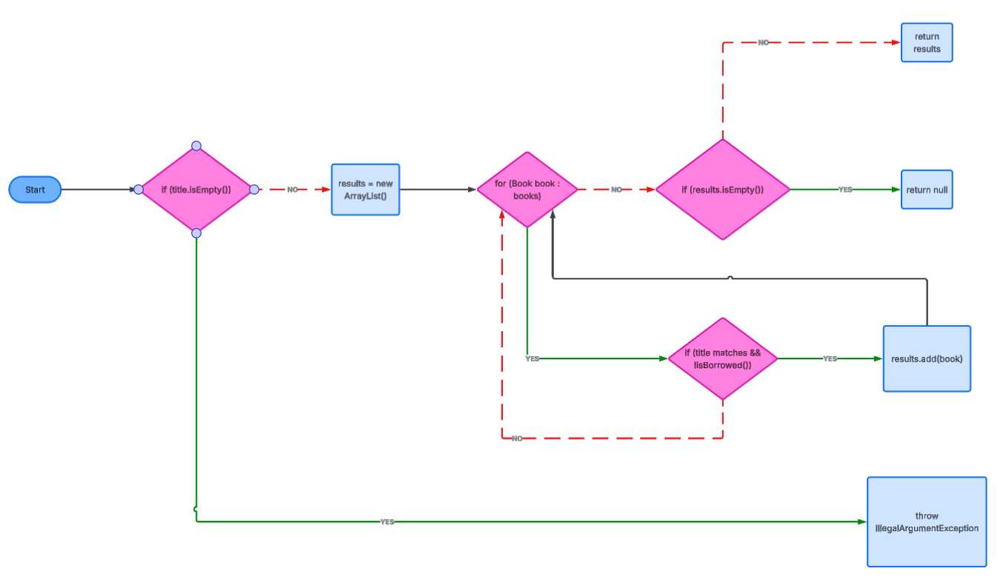
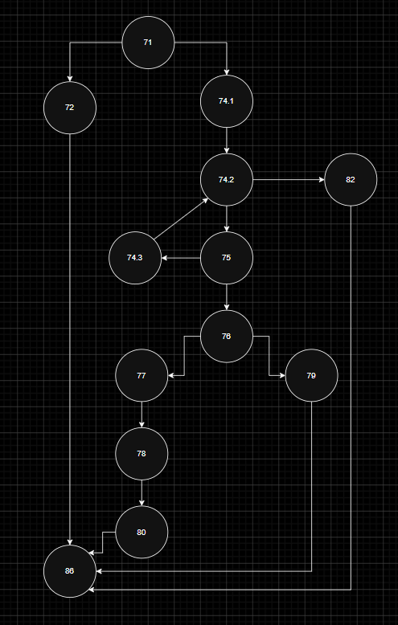

# SI_2026_lab2_236032

## Luka Apostolov 236032

### Control Flow Graph

### Цикломатска комплексност

Цикломатската комплексност е дефинирана со `V(G) = E - N + 2`, каде што `E` е број на ребра и `N` е број на јазли на CFG.

`V(G) = 12 - 10 + 2 = 4` за функцијата `searchBookByTitle`

`V(G) = 13 - 10 + 2 = 5` за функцијата `borrowBook`

### Тест случаи според критериумот Every Statement

Треба да има минимално 3 тест случаи за да се постигне критериумот Every Statement за функцијата `searchBookByTitle`.

Test 1: title="" - throws IllegalArgumentException - покрива: if(title.isEmpty()) → throw

Test 2: title="Clean Code" (постои) - враќа листа - покрива: new ArrayList(), for јамка, if(matches && !isBorrowed()), results.add(), return results

Test 3: title="NonExistent" (не постои) - враќа null - покрива: if(results.isEmpty()) → return null

### Тест случаи според критериумот Every Branch

Треба да има минимално 5 тест случаи за да се постигне критериумот Every Branch за функцијата `borrowBook`.

Test 1: title="" - throws IllegalArgumentException - гранка: if(isEmpty||isEmpty) = true (title празен)

Test 2: title="The Hobbit", author="" - throws IllegalArgumentException - гранка: if(isEmpty||isEmpty) = true (author празен)

Test 3: title="Unknown", author="Author" - throws RuntimeException - гранка: for завршува без match

Test 4: title="The Hobbit", author="Tolkien" (достапна) - позајмува успешно - гранка: if(matches) = true, if(!isBorrowed) = true

Test 5: title="The Hobbit", author="Tolkien" (веќе позајмена) - throws RuntimeException - гранка: if(!isBorrowed) = false

### Тест случаи според критериумот Multiple Condition

Треба да има минимално 4 тест случаи за да се постигне критериумот Multiple Condition.

За условот `if (book.getTitle().equalsIgnoreCase(title) && !book.isBorrowed())` во `searchBookByTitle` со помош на Truth Table:

Test 1: titleMatches=T, !isBorrowed=T → книгата се додава во резултатите

Test 2: titleMatches=T, !isBorrowed=F → книгата не се додава

Test 3: titleMatches=F, !isBorrowed=F → книгата не се додава

Test 4: titleMatches=F, !isBorrowed=T → книгата не се додава

За условот `if (title.isEmpty() || author.isEmpty())` во `borrowBook` со помош на Lazy Evaluation TXX, FT, FF:

Test 1: title.isEmpty()=T, author.isEmpty()=T → throws IllegalArgumentException

Test 2: title.isEmpty()=T, author.isEmpty()=F → throws IllegalArgumentException

Test 3: title.isEmpty()=F, author.isEmpty()=T → throws IllegalArgumentException

Test 4: title.isEmpty()=F, author.isEmpty()=F → продолжува со извршување

### Објаснување на напишаните unit tests

За тестовите кои го исполнуваат Every Statement критериумот користам `assertThrows` со цел да ги фатам exceptions-от кои ги фрла функцијата и да проверам дали се тие кои што ги очекуваме. За успешниот случај користам `assertNotNull` и `assertNull` за да го проверам резултатот.

За тестовите според Every Branch критериумот, покрај `assertThrows` за негативните случаеви, користам `assertTrue` за да проверам дека книгата е навистина означена како позајмена.

За тестовите според Multiple Condition критериумот ги покривам сите комбинации на под-услови за двата кои се тестираат.